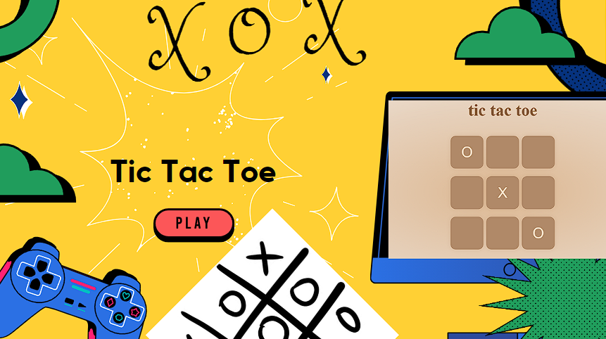

# Tic Tac Toe Game

This is a simple implementation of the Tic Tac Toe game in HTML, CSS, and JavaScript. It provides a basic two-player experience.

## Instructions

1. Open `tic tac toe` in your web browser.
2. Click on the cells to make your moves.
3. The game will notify you of the winner or a tie.

## Features

- Responsive design for various screen sizes.
- Clear indication of player turns and game outcome.
- Simple and easy-to-understand codebase.

## Development

If you want to contribute or modify the game, feel free to fork the repository and make your changes. Pull requests are welcome!

